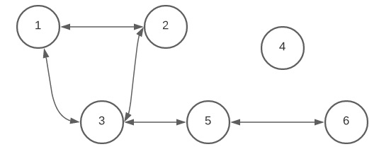

# Регионы II

В некоторой стране есть n населенных пунктов, пронумерованных через `1, 2, 3, … , n`.
Некоторые населенные пункты соединены дорогами, обозначаемые через (`i`,`j`). Движение по
каждой из этих дорог является двусторонним, а именно, по дороге (`i`,`j`) можно проехать от населенного пункта `i` 
к населенному пункту `j` и от от населенного пункта `j` к населенному пункту `i`.  
По определению, любая дорога (`i`,`j`) не проходит ни через один другой населенный пункт.  

Любая последовательность дорог (`i`, `k`), (`k`, `m`), ...,
(`l`,`j`), по которой, из населенного пункта `i` можно доехать до
населенного пункта `j`, соблюдая, естественно, правила дорожного движения, называется маршрутом и
обозначается через (`i`, `k`, `m`, … , `l`,`j`). Населенные пункты `i`, `j` называются связанными, 
если существует хотя бы один маршрут от `i` до `j`, а следовательно и один маршрут от `j` до `i`. 
По определению, каждый населенный пункт связан с самим собой.




В примере, показанном на рисунке, населенные пункты 1, 2, 3, 5, 6 связаны, т.к. cуществуют маршруты между любыми 
двумя городами в этой группе.

Правительство решило объединить населенные пункты страны в регионы. Каждый
регион должен включать только населенные пункты, связанные между собой. Из
соображений административной эффективности, число регионов должно быть минимальным.

# Задание
Напишите программу, которая, зная населенные пункты и дороги, связывающие их, 
вычисляет минимально возможное число регионов, состоящих из связанных населенных пунктах.

# Входные данные
Стандартный ввод содержит в первой строке целое число `n`. 
Каждая из следующих строк стандартного ввода содержит по два целых числа, разделенных пробелом.
Первое число указывает населенный пункт `i`, а второе число ─ населенный пункт `j` дороги (`i`,`j`).
Перечень дорог заканчивается строкой, содержащей два значения 0, разделенных пробелом.

# Выходные данные
Стандартный вывод должен содержать в единственной строке одно  целое число ─ минимально возможное число регионов.

# Ограничения. 
* 3 ≤ `n` ≤ 1000. 
* Время выполнения программы не должно превышать 0,5 секунды. 
* Объем используемой оперативной памяти не должен превышать 16 Мегабайт.
* Исходный файл должен иметь имя `regiuni2.pas`, `regiuni2.c` или `regiuni2.cpp`.

# Пример 1
Ввод
```
6
1 2
3 1
2 3
3 5
6 5
```

Вывод
```
2
```

