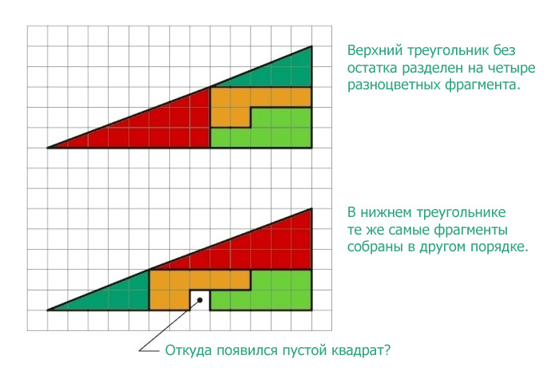

Перед вами два треугольника. Верхний разделен без остатка на четыре фрагмента, окрашенные разными цветами. В нижнем треугольнике те же самые фрагменты расположены в другом порядке. Внимание, вопрос. Откуда взялся лишний пустой квадрат?

