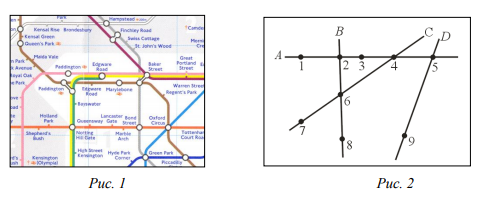

# Метро
* Республиканская Олимпиада Молдовы по информатике
* Год: 2018
* Класс: 7-9
* День: 2
* Задача: 2

Лондонское метро представляет собой комплексную систему, которая ежедневно
перевозит миллионы людей (Рис. 1). С точки зрения пассажира, метро представляет собой
множество линий поездов и множество станций. В целях наглядности, обозначим линии
поездов большими буквами A, B, C, D и т.д. латинского алфавита, всего n линий, а станции −
натуральными числами 1, 2, 3,..., всего m станций (Рис. 2).


Линии поездов и соответствующие им станции были спроектированы таким образом,
чтобы пассажир, отправляясь из любой станции x смог бы добраться до любой другой
станции y. Очевидно, в случаях, когда станции находятся на разных линиях, пассажиру
необходимо сделать одну или несколько пересадок, меняя поезда на станциях, где
пересекаются две или больше линий.
Например, для того чтобы проехать от станции 1 до станции 8 (Рис. 2), пассажир может
сделать всего лишь одну пересадку на станции 2 или две пересадки – первую на станцию 4, а
вторую на станцию 6.

# Задание 
Напишите программу, которая, зная план метро, станцию отправления x и
станцию прибытия y, вычисляет минимальное число необходимых пересадок.

# Входные данные
Стандартный ввод содержит в первой строке натуральные числа n,
m, x, y разделенные пробелами. Следующие n строк стандартного ввода содержат номера
станций, разделенные пробелами. Вторая строка стандартного ввода содержит номера
станций линии A, третья строка стандартного ввода содержит номера станций линии B и т. д.


# Выходные данные. 
Стандартный вывод должен содержать в единственной строке
целое число – минимальное число пересадок.

# Ограничения. 
* 2 <= n <= 26, 
* 3 <= m <= 250, x != y. 
* Время выполнения программы не должно превышать 0,05 секунд. 
Программа должна использовать не более 1 Мегабайта оперативной памяти. 
Исходный файл должен иметь одно из названий `metrou.pas`, `metrou.c` или `metrou.cpp`

# Пример 1
Вход 
```
4 9 1 8
1 2 3 4 5
2 6 8
7 6 4
5 9
```

Выход
```
1
```

# Похожие задачи
1. [127. Word Ladder](https://leetcode.com/problems/word-ladder/)


