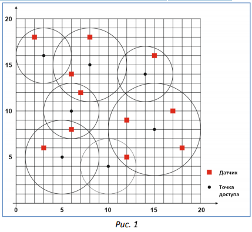
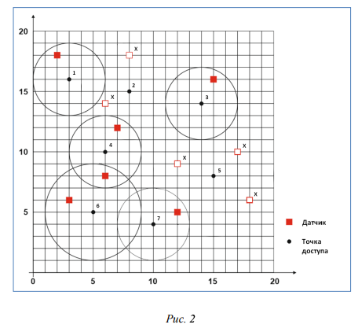

# Датчики

* Республиканская Олимпиада Молдовы по информатике
* Год: 2018
* Класс: 7-9, 10-12
* День: 2
* Задача: 3

Центральный парк столицы оснащен системой полива растений с цифровым
программным управлением. Спринклеры в этой системе включаются и выключаются в
зависимости от влажности земли на участках, где они установлены.
Для измерения влажности, в парке установлены датчики, число которых равно K. В
дидактических целях,
датчикам присвоены номера `1, 2, 3, ..., K`. Координаты датчика `i` обозначаются через `x[i], y[i]`.
Датчики передают данные компьютеру, управляющему системой полива по сети Wi-Fi. Указанная сеть состоит из `N`
точек беспроводного доступа (см. Рис. 1).


Точкам беспроводного доступа присвоены номера `1, 2, 3, ..., j, ..., N`. 
Координаты точки доступа `j` обозначаются через `x[j], y[j]`, а ее радиус действия – через `r[j]`.
Очевидно, датчик `i` может обмениваться информацией с точкой доступа `j` только в том случае, 
если расстояние между ними не превышает радиус действия `r[j]` соответствующей точки доступа.

Напоминаем что расстояние `d[i][j]` между точками с декартовыми координатами `(x[i], y[i])` и `(x[j], y[j])` вычисляется по формуле:

`d[i][j]` = `sqrt(x[i] − x[j])^2 + (y[i] − y[j])^2`

Со временем, из-за неблагоприятных условий эксплуатации, некоторые точки доступа
выходят из строя. Поскольку они стоят больших денег, администрация парка решила менять
не сами точки доступа, а те датчики, которые, из-за отказа некоторых точек доступа,
потеряли связь с управляющим компьютером. Планируется, что указанные датчики будут
заменены на датчики нового типа, которые будут взаимодействовать с компьютером
напрямую, без использования точек доступа.

Для оценки необходимых затрат, администрации парка необходимы данные о
количестве датчиков подлежащих замене. Администрация располагает следующей
технической информацией о системе полива:
* число датчиков `K` и координаты `x[i], y[i]` каждого датчика `i`;
* число точек доступа `N`, координаты `x[j], y[j]` и радиус действия `r[j]` каждой точки доступа `j`;
* число вышедших из строя точек доступа `M` и номера этих точек доступа.

# Задание
Напишите программу, которая, зная информацию о системе полива, вычисляет число датчиков, которых необходимо заменить.

# Входные данные 
Первая строке входного файла `tests.in` содержит количество тестов `T`. Каждый тест представлен следующим образом:

Первая строка теста содержит целое число `K`. 

Следующие `K` строк  содержат описания датчиков. 

Строка `(i + 1)` содержит описание датчика `i`: целые числа `x[i], y[i]`, разделенные пробелом.

Следующая строка содержит целое число `N`. 

Следующие `N` строк содержат описания  точек беспроводного доступа. 

Строка `(i + 2 + N + 1)` содержит описание точки доступа `j`:  целые числа `x[j], y[j], r[j]`, 
разделенные пробелами.

Следующая строка содержит целое число `M`. Следующая,
последняя строка содержит `M` целых чисел, разделенных пробелами: номера вышедших из строя точек доступа.


#Выходные данные 
Файла `tests.out` должен содержать в каждой строке ответ для i-го теста, целое число `S[i]`.

# Ограничения
* `1 <= K <= 500`; 
* `1 <= N <= 200`; 
* `0 <= M <= N`. 
* Радиусы действия точек доступа `r[j] , j = 1, 2, 3, … , N`, являются натуральными числами из интервала [0, 50].
* Координаты `x[i], y[i]` датчиков и координаты `x[j], y[j]` точек доступа являются целыми числами из интервала [-1000, +1000]. 
* Время выполнения программы не должно превышать 0,05 секунды.
* Программа должна использовать не более 1 Мегабайта оперативной памяти. 
* Исходный файл должен иметь имя senzori.pas, senzori.c или senzori.cpp.

# Пример
Вход 
```
1
11
2 18
8 18
15 16
6 14
7 12
17 10
12 9
6 8
3 6
18 6
12 5
7
3 16 3
8 15 4
14 14 3
6 10 3
15 8 5
5 5 4
10 4 3
2
2 5
```

Выход
```
5
```

# Пояснение 
Точки беспроводного доступа 2 и 5 вышли из строя (см. Рис. 2). 
Вследствие этого, датчики, отмеченные на Рис. 2 символом «x», потеряли связь с управляющим
компьютером. Очевидно, число таких датчиков равно 5.



