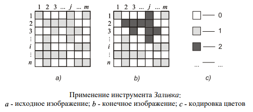

# Изображения
* Республиканская Олимпиада Молдовы по информатике
* Год: 2019
* Класс: 10
* День: 2
* Задача: 3

 В памяти компьютера цветные картины (см. рисунок) представляются в виде
 двухмерного массива `B = b[i][j]`, содержащего `n` строк и `m` столбцов. 
 Каждый элемент `b[i][j]` массива является натуральным числом указывающем в определенном коде цвет
 соответствующей микрозоны, например, белый (b[i][j] = 0), черный (b[i][j] = 1), красный (b[i][j] = 2) и т.д.
 
 Для раскраски изображений цветные редакторы предлагают пользователю специальный
 инструмент, названный Заливка. Применение указанного инструмента моделирует
 процесс растекания краски из “баночки” в текущую микрозону, из текущей микрозоны в
 соседние микрозоны того же цвета и т.д. Очевидно, краска может растекаться из одной
 микрозоны в другую только в том случае если у них есть общая сторона.
 Задание. Напишите программу для реализации инструмента Заливка.
 
 # Задание. 
 Напишите программу для реализации инструмента Заливка.
 
 
 
 # Входные данные 
 Текстовый файл `IMAGINI.IN` содержит в первой строке
 натуральные числа `n`, `m` разделенные пробелом. Каждая из следующих `n` строк содержит по `m`
 чисел разделенных пробелами. Строка `i +1` входного файла содержит числа `b[i][1]`, `b[i][2]`, ..., `b[i][m]`
 исходного изображения. Последняя строка входного файла содержит три натуральных числа
 `p`, `q`, `k` разделенные пробелами. Числа `p`, `q` указывают координаты микрозоны к которой
 применяется инструмент Заливка, а число k - цвет краски из “баночки”.
 
 # Выходные данные 
 Текстовый файл `IMAGINI.OUT` должен содержать `n` строк, каждая
 из которых содержит по `m` чисел разделенных пробелами. Строка `i` выходного файла содержит
 числа `b[i][1]`, `b[i][2]`, ..., `b[i][m]` конечного изображения.
 
 # Ограничения. 
 * `1 <= n, m <= 20`, 
 * `0 <= b[i][j], k <= 10, b[i][j] != k` . 
 * Исходный файл должен иметь имя `IMAGINI.PAS`, `IMAGINI.C` или `IMAGINI.CPP`.
 
 # Пример. 
 Для приведенного выше рисунка получаем:
 
IMAGINI.IN
```
7 7
1 0 0 0 1 0 1
0 1 1 1 1 0 0
0 0 1 0 1 1 0
0 1 0 0 1 0 0
0 1 0 0 0 1 1
1 1 1 1 0 0 0
0 1 0 0 0 1 1
2 3 2
```

IMAGINI.OUT
```
1 0 0 0 2 0 1
0 2 2 2 2 0 0
0 0 2 0 2 2 0
0 1 0 0 2 0 0
0 1 0 0 0 1 1
1 1 1 1 0 0 0
0 1 0 0 0 1 1
```