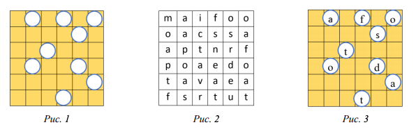

# Сообщения
* Республиканская Олимпиада Молдовы по информатике
* Год: 2019
* Класс: 10
* День: 1
* Задача: 3

Два друга передают друг другу сообщения. Чтобы быть уверенными что только адресат
прочитает сообщение, они используют оригинальный метод. У друзей есть одинаковые
дощечки с отверстиями. Для того, чтобы раскодировать сообщение, нужно наложить на текст
дощечку так, чтобы в отверстия можно было видеть символы сообщения.


Дощечка с отверстиями представлена на `рис. 1`. Отправленный текст представлен на рис.
2. На рис. 3 представлена дощечка, наложенная на текст.


Сообщение читается с верху вниз, слева на право. После того как были прочитаны все
буквы, дощечка поворачивается по часовой стрелке на 90 градусов, читается следующий
набор символов, и т.д. до полного оборота на 360 градусов.

# Задача. 
Напишите программу, которая возвращает расшифрованное с помощью дощечки сообщение.

# Входные данные. 
Стандартный ввод содержит на первой строке целое число `N` –
количество строк и столбцов дощечки. 
На следующих `N` строках записаны `N` цифр, разделённые пробелами, которые описывают расположение 
отверстий на дощечке: 
1 – нет отверстия, 
0 – есть отверстие. 
На следующих `N` строках записаны `N` букв, разделённые пробелами, которые представляют 
закодированный текст.

# Выходные данные. 
Стандартный выход содержит одну строку с расшифрованным сообщением, без пробелов.

# Пример.
Вход 
```
6
1 0 1 0 1 0
1 1 1 1 0 1
1 1 0 1 1 1
1 0 1 1 0 1
1 1 1 1 1 0
1 1 1 0 1 1
m a i f o o
o a c s s a
a p t n r f
p o a e d o
t a v a e a
f s r t u t
```

Выход
```
afostodatcanpovestiopreafrumoasafata
```

# Ограничения. 
`N ≤ 100`. 
Ограничения на время выполнения программы и на объем используемой памяти приведены в общем описании 
предложенных для решения задач.
Исходный файл должен иметь имя `mesaje.pas`, `mesaje.c` или `mesaje.cpp`.