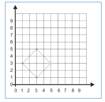

# Арена
* Республиканская Олимпиада Молдовы по информатике
* Год: 2019
* Класс: 11
* День: 1
* Задача: 1

Первые земляне, прибывшие на Марсе, нашли на этой планете множество старинных
руин. В частности, были найдены и руины арен, на которых когда-то, вероятнее всего,
боролись марсианские гладиаторы. Каждая из этих арен имеет форму правильного
многоугольника (см 1) , однако размеры и количество сторон различны для разных арен. В каждом
углу арены (в каждой вершине многоугольника) был вбит столб. Между столбами
натягивались веревки (стороны многоугольника) которые и разграничивали арену.


Недавно археологи с земли обнаружили на Марсе еще одну арену. К несчастью, из всех
столбов которые обозначали углы арены, сохранилось только три, остальные были разрушены
марсианскими бурями.


В настоящее время археологи пытаются определить, какое минимальное количество
столбов `n` могли быть использованы для разграничения недавно обнаруженной арены.

# Задание. 
Напишите программу, которая, по известным картезианским координатам `x`, `y`
каждого из оставшихся трех столбов, определят минимально возможное количество вершин `n`
которые могла бы иметь арена.

# Входные данные. 
Стандартный ввод содержит три строки. Каждая строка содержит по
два вещественных числа, разделённых пробелами. `i-я` строка стандартного ввода содержит
картезианские координаты `x[i]`, `y[i]` `i-ого` столба.

# Выходные данные. 
Стандартный ввод содержит в единственной строке целое число `n`.

# Ограничения. 
* −1000 ≤ x[i], y[i] ≤ 1000`; 
* `n ≤ 100`. 
* Число десятичных цифр в записи вещественных чисел `x[i]`, `y[i]` не превышает шести. 
* Исходный файл должен иметь имя arena.pas, arena.c или arena.cpp.

# Пример. 
 
Ввод
```
1.000000 3.000000
3.000000 1.000000
3.000000 5.000000
```

Вывод
```
4
```

# Объяснение.
Стороны правильного многоугольника имеют
одинаковую длину. Так как расстояния между столбами не
равны, логично предположить существование еще минимум
одного столба (вершины) который использовался для
разграничения арены. Действительно, добавление вершины в
точку с координатами (5, 3) приводит к образованию квадрата с
равными сторонами и конгруэнтными углами. (см.
прилагаемый рисунок). В общем случае, количество сторон
любого другого правильного многоугольника содержащего
исходные точки (столбы), равно `4k`, где `k = 1, 2, 3` и т.д. 

