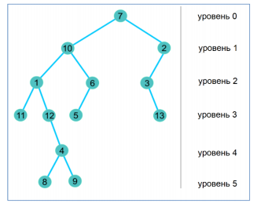

# Звездорыл
У Иона большая проблема – у него на огороде завелся звездорыл. Хотя звездорыл и не
вредит, холмики которыми он усеял все грядки портят вид огорода. Ион хотел бы прогнать
звездорыла, не навредив ему. Для начала Ион решил разведать жилище звездорыла.


В результате исследований, выполненных с помощью автономного микробота, Ион
выяснил, что жилище звездорыла имеет древовидную структуру, с множеством норок (смотри
рисунок). 



Ион пронумеровал норки в произвольном порядке, используя последовательные числа 
`1, 2, 3, …, N`.

Звездорыл перемещается между норками по прямым галереям. Входом в жилище
звездорыла является ближайшая к поверхности норка (норка находящееся на
уровне 0).

Каждае из находящехся на уровне `i, i = 1, 2, 3` и т.д. норок обязательно соединена
галереей с норкой находящейся на уровне `(i-1)` и с не более чем двумя норками на уровне `(i+1)`.
Галереи проложены наклонно, следовательно возможны следующие случаи:
1) Норка, находящаяся на уровне `i`, не имеет галерей к норкам, находящимся на уровне `(i+1)`;
2) Норка, находящаяся на уровне `i`, соединена галереей с наклоном влево с единственной
норкой, находящейся на уровне `(i+1)`;
3) Норка, находящаяся на уровне `i`, соединена галереей с наклоном вправо с единственной
норкой, находящейся на уровне `(i+1)`;
4) Норка, находящаяся на уровне `i`, соединена наклонными галереями с двумя норками
находящимися на уровне `(i+1)`: с первой – через галерею с наклоном вправо, со второй –
через галерею с наклоном влево.

Чтобы прогнать звездорыла, Ион решил установить в его жилище два отпугивающих
устройства - микроскопические ультразуковые генераторы, излучение которых, как надеется
Ион, заставит звездорыла «переселиться» в соседний, пустующий огород.


После долгих размышлений, Ион решил что наилучшим вариантом установки
генераторов будет их размещение в крайних, в самой левой и в самой правой норках,
находящихся на одном и том же уровне жилища звездорыла. Но, так как нумерация норок
производилась произвольно, а данные переданные микроботом имеют специфическую
структуру, Ион не знает номера крайних норок выбранного уровня `K`.

Например, если бы Ион решил установить отпугивающие устройства в крайние норки,
находящихся на 3-м уровне, их номерами были бы 11 и 13.

# Задание. 
Напишите программу, которая зная выбранный Ионом уровень `K` и данные собранные микро роботом, 
определяет номера крайних норок, самой левой и самой правой.

# Входные данные. 
Первая строка стандартного ввода содержит целые числа `N` и `K`,
разделенные пробелами. 
Каждая из следующих `N-1` строк стандартного ввода содержит по два
целых числа и одну из букв `S`, `D`, разделенные пробелами. 
Каждая пара чисел описывает пару норок, соединенных галереей: первое число является номером норки находящейся на уровне
`i`, второе число является номером норки находящейся на уровне `(i+1)`. 
Буква `S` указывает на  галерею с наклоном влево (норка находящейся на уровне `(i+1)` расположена левее), а буква `D`
указывает на галерею с наклоном вправо (норка находящейся на уровне `(i+1)` расположена
правее) норки находящейся на уровне `i`.

# Выходные данные. 
Стандартный вывод содержит в единственной строке два целых числа разделенных пробелом: 
номер крайней левой норки и номер крайней правой норки заданного уровня `K`.

# Ограничения. 
* `3 ≤ N ≤ 1000000; 0 ≤ K ≤ 500`. 
* Имя исходного файла sobol.pas, sobol.c или sobol.cpp

# Пример 1. 
 
Ввод
```
13 3
4 8 S
10 6 D
7 2 D
4 9 D
1 12 D
6 5 S
12 4 D
2 3 S
3 13 D
1 11 S
10 1 S
7 10 S
```

Вывод
```
11 13
```

# Похожие задачи
[102. Binary Tree Level Order Traversal](https://leetcode.com/problems/binary-tree-level-order-traversal/)
