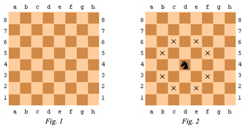

# Компьютерные шахматы
* Республиканская Олимпиада Молдовы по информатике
* Год: 2019
* Класс: 9
* День: 2
* Задача: 3

Известно, что в случае классических шахмат игра происходит на доске квадратной
формы, разделенной на 8 горизонтальных рядов (горизонтали) и 8 вертикальных столбцов
(вертикали), которые образуют 64 квадрата с равными поверхностями, называемыми полями.
Поля окрашены попеременно в черный и белый цвета (см. Рисунок 1).


Горизонтали классической шахматной доски пронумерованы 1, 2, 3, ..., 8, а вертикали -
строчными буквами латинского алфавита a, b, c, ..., h. Поля обозначаются буквой вертикали,
за которой следует номер горизонтали. Например, поле, на котором расположен конь
показанный на Рисунке 2, обозначается как d4.


В случае компьютерных шахмат доска также имеет квадратную форму, но может
содержать до 26 вертикалей, обозначенных буквами a, b, c, ..., z, и, соответственно, до 26
горизонталей, обозначенных номерами 1, 2, 3, ... , 26. Поля указываются с помощью
символьных строк вида:
`<Вертикаль><Горизонталь>`
где `<Вертикаль>` - одна из строчных букв латинского алфавита, а `<Горизонталь>` - один из
номеров `1, 2, 3, ..., 26`.
Примеры: `d4, d21, y5, y12`.

Каждый из игроков в компютерные шахматисты имеет ровно по одной фигуре: первый
игрок имеет одного белого коня, а второй игрок – одного черного коня.


Как и в случае классических шахмат, ходить конем в случае компьютерных шахмат
можно только в форме буквы `«L»`, как показано на Рисунке 2. На этом рисунке поля, на
которые за один ход может перейти конь с поля `d4`, помечены знаком «×».


В отличие от классических шахмат, в которые игроки ходят последовательно, друг за
другом, и на каждом поле может находиться ровно одна фигура, в компьютерных шахматах
оба игрока ходят одновременно, а на одном поле могут находиться не только одна, но и две
фигуры.

В случае классических шахмат, ход фигурой описывается символьной строки вида:
`<Ход фигурой> :: = <Вертикаль 1><Горизонталь 1>-<Вертикаль 2><Горизонталь 2>`
где:

`<Вертикаль 1><Горизонталь 1>` - указывает поле, c которого снимается шахматная
фигура;
`<Вертикаль 2><Горизонталь 2>` - указывает поле, на котором ставится шахматная
фигура.

Например, в случае `Рисунка 2`, ход конем с поля `d4` на поле `f5` описывается с помощью
символьной строки `d4-f5`, а ход конем с того же поля на поле `c2` описываться с помощью
символьной строки `d4-c2`.

В случае компьютерных шахмат, совместный ход коней описывается символьной строки
вида:
`<Ход конями в компьютерных шахматах> :: = <Ход белым конем>&<Ход черным конем>`
Например, обозначение:
`d4-f3&a1-b3`
имеет следующий смысл: белый конь переходит с поля `d4` на поле `f3`, а черный конь - с поля
`a1` на поле `b3`.


Будучи компьтерным шахматистом, Ион решил разработать стратегию, которая
обеспечила бы ему как можно больше выигрышей. Для начала, ему нужна программа, которая
вычисляет минимальное число ходов, необходимых для того, чтобы оба коня - и черный, и
белый - оказались вместе на одном и том же поле, неважно на каком. Подчеркиваем, что в при
каждом ходе игры в компьютерные шахматы, оба коня - и белый, и черный - обязательно
должны изменить свои позиции на шахматной доске..

# Задание. 
Напишите программу, которое, зная исходные поля на которых находятся
кони, вычисляет минимальное количество ходов, необходимых для того, чтобы оба коня
оказались вместе на одном из полей, неважно на каком.


# Входные данные. 
Стандартный вход содержит в первой строке целое число N - число
горизонталей квадратной компьтерной шахматной доски. 
Вторая строка стандартного ввода содержит две символьные строки, разделенные пробелом. Первая строка указывает поле на
котором находится белый конь, а вторая - поле, на котором находится черный конь.

# Выходные данные. 
Стандартный вывод должен содержать в одной строке целое число `M` - минимальное количество ходов, 
необходимое для перемещения обоих коней на одно и то же поле, неважно на какое. 
Если это невозможно, в стандартный вывод сдедует записать целое
число `«-1»`.

# Ограничения. 
* `1 < N ≤ 26`. 
* Исходный файл должен иметь имя `sahul.pas`, `sahul.c` или `sahul.cpp`.


# Пример 1
Ввод
```
a1 a3
```

Вывод
```
1
```

Пояснение: Достаточен ровно один ход: `a1-c2&a3-c2`.

# Пример 2
Ввод
```
a1 a1
```

Вывод
```
-1
```

Пояснение: Не существует ни одной последовательности ходов, которая удовлетворяла бы условиям задачи.

# Похожие задачи
1. [119 Minimum Knight Moves](https://leetcode.com/problems/minimum-knight-moves/)